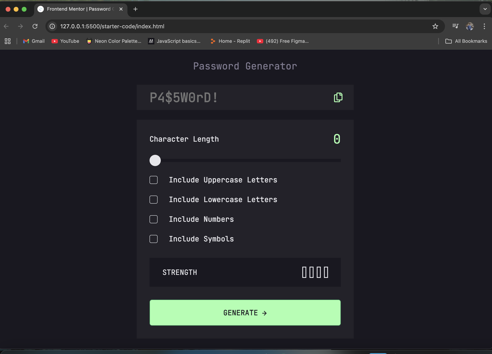

# Frontend Mentor - Password generator app

## Welcome! 👋

Thanks for checking out this front-end coding challenge.

### The challenge

Users should be able to:

- View the optimal layout for the site depending on their device's screen size

### Links

- Solution URL: [Solution URL](https://github.com/SurajCasey/Password-Generator-App)
- Live Site URL: [Live Site](https://surajcasey.github.io/Password-Generator-App/)

## My process

### Built with

- Semantic HTML5 markup
- CSS custom properties
- Flexbox
- Bootstrap
- JavaScript

### Continued development

I would like to learn a lot about about CSS flexbox, grid and positioning to be good at design.

### Useful resources

- [CSS Flexbox]

## Author
- Frontend Mentor - [@SurajCasey](https://www.frontendmentor.io/profile/SurajCasey)
- Linkedin - [@SurajKhatri](https://www.linkedin.com/in/surajkhatri445/)

## Acknowledgments
I acknowledge frontend mentor community for helping me to flourish my frontend skills. In any problems they have provided me with the solutions.
